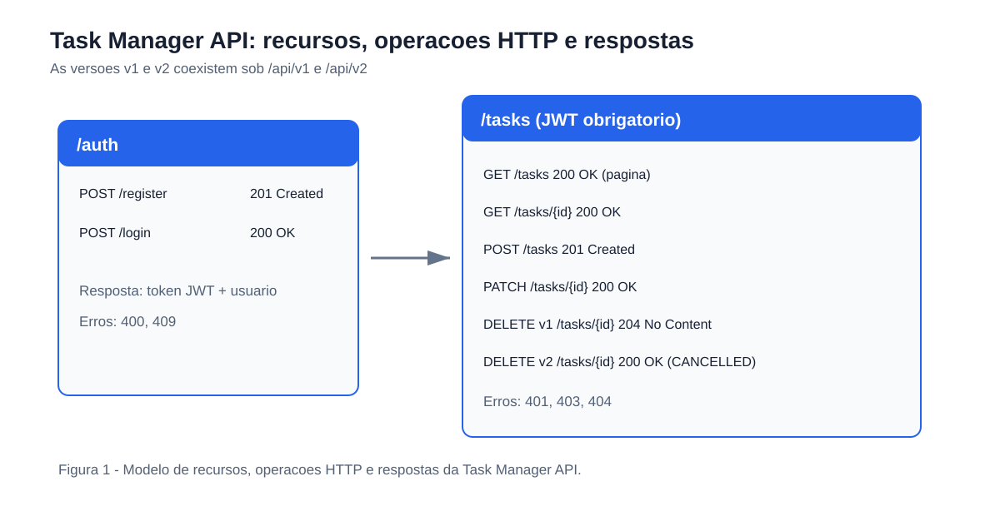
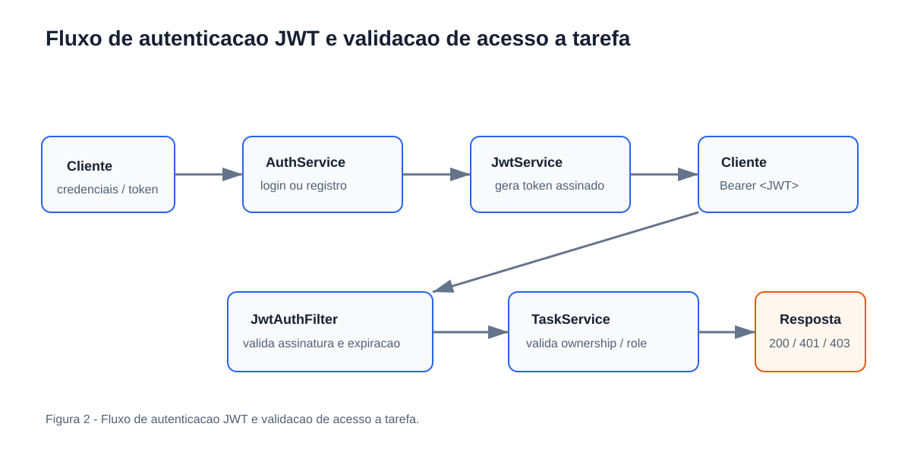
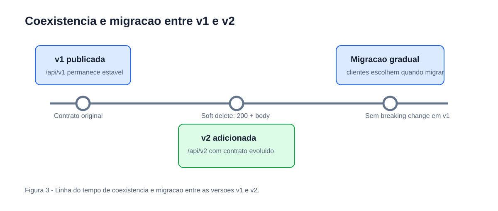
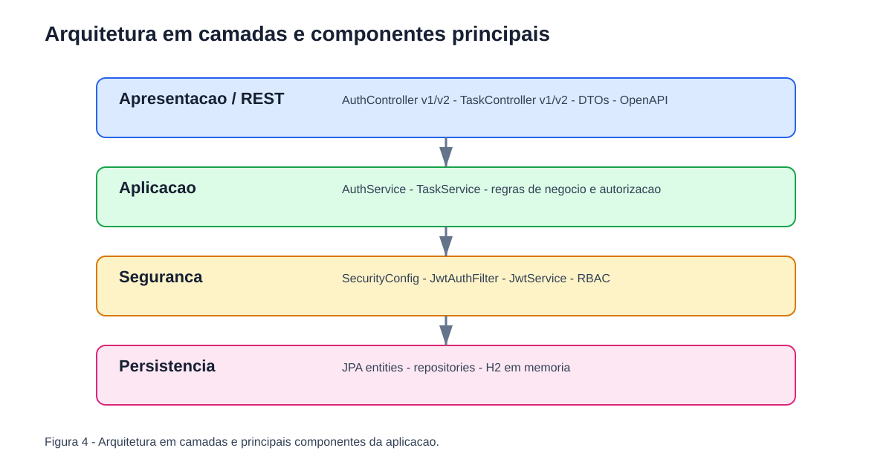
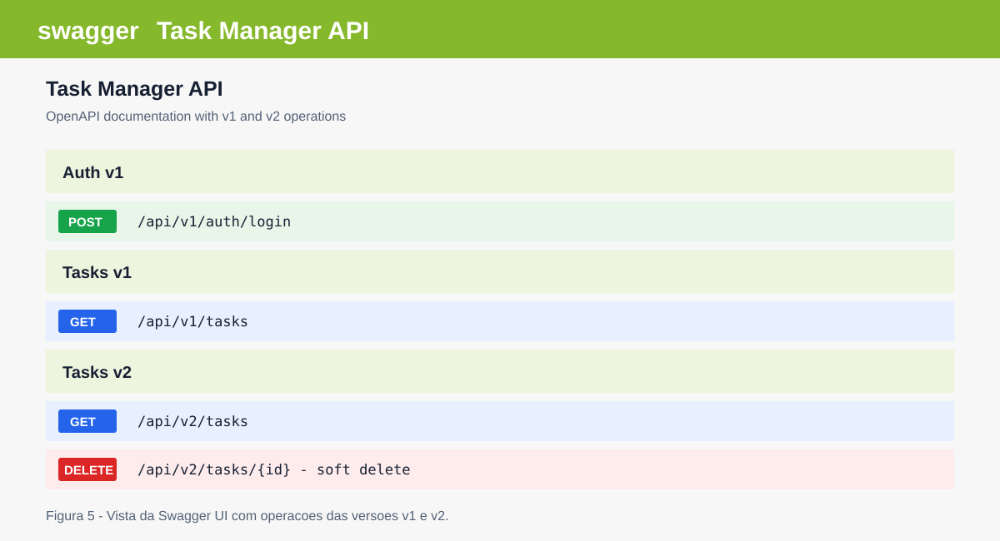

# TCC – Task Manager API
**Estudo de Caso:** Estruturação e Gerenciamento de APIs REST: Boas Práticas, Segurança e Versionamento  
**Aluno:** Kaio Antônio Andrade Rodrigues | **Orientador:** Prof. Arthur Pinheiro | **Curso:** Engenharia de Software

---

## Visão Geral
API RESTful construída em **Java 17 + Spring Boot 3** como estudo de caso do TCC. Demonstra na prática:

| Conceito | Implementação |
|---|---|
| Padronização REST | Naming de endpoints, status HTTP, paginação, filtros |
| Autenticação | JWT stateless (`/api/v1/auth/login`) |
| Autorização | RBAC com `ROLE_ADMIN` e `ROLE_USER` |
| Documentação | OpenAPI 3 / Swagger UI |
| Versionamento | URI (`/api/v1` → `/api/v2`) com breaking change documentada |
| Validação | Bean Validation em todos os DTOs de entrada |
| Tratamento de Erros | Handler global (`GlobalExceptionHandler`) |
| Segurança (OWASP) | Autenticação robusta, autorização por recurso, sem vazamento de dados internos |

---

## Estrutura do Projeto
```
src/main/java/org/example/
├── Main.java                          # Spring Boot entry point
├── config/
│   ├── SecurityConfig.java            # Configuração Spring Security + STATELESS
│   ├── OpenApiConfig.java             # Especificação OpenAPI 3
│   └── DataInitializer.java           # Usuários de teste
├── controller/
│   ├── v1/                            # Endpoints /api/v1/**
│   │   ├── AuthController.java
│   │   └── TaskController.java
│   └── v2/                            # Endpoints /api/v2/** (evolução controlada)
│       ├── AuthController.java
│       └── TaskController.java
├── dto/
│   ├── request/  (LoginRequest, RegisterRequest, TaskRequest, TaskUpdateRequest)
│   └── response/ (AuthResponse, UserResponse, TaskResponse, PagedResponse)
├── exception/
│   ├── ApiException.java              # Base exception
│   ├── ResourceNotFoundException.java
│   ├── ForbiddenException.java
│   ├── ConflictException.java
│   └── GlobalExceptionHandler.java    # Handler global padronizado
├── model/
│   ├── User.java
│   ├── Task.java
│   └── enums/ (Role, TaskStatus)
├── repository/ (UserRepository, TaskRepository)
├── security/
│   ├── JwtService.java                # Geração e validação JWT
│   ├── JwtAuthFilter.java             # Filtro Bearer por requisição
│   └── UserDetailsServiceImpl.java
└── service/ (AuthService, TaskService)
```

---

## Como Executar

### Pré-requisitos
- Java 17+
- Maven 3.8+ (ou usar a IDE diretamente)

### Rodar a aplicação
```bash
# via Maven
mvn spring-boot:run

# ou via IntelliJ: Run > Main.java
```

### Acessar a documentação
- **Swagger UI:** http://localhost:8080/swagger-ui.html
- **OpenAPI JSON:** http://localhost:8080/api-docs
- **H2 Console:** http://localhost:8080/h2-console (JDBC URL: `jdbc:h2:mem:tccdb`)

---

## Usuários de Teste (criados automaticamente)

| Role | Email | Senha |
|------|-------|-------|
| ADMIN | admin@example.com | admin123 |
| USER | user@example.com | user1234 |

---

## Guia Rápido: Fluxo de Uso

### 1. Login
```bash
curl -X POST http://localhost:8080/api/v1/auth/login \
  -H "Content-Type: application/json" \
  -d '{"email":"user@example.com","password":"user1234"}'
```

### 2. Criar tarefa (com token JWT)
```bash
curl -X POST http://localhost:8080/api/v1/tasks \
  -H "Authorization: Bearer <TOKEN>" \
  -H "Content-Type: application/json" \
  -d '{"title":"Minha Tarefa","dueDate":"2026-12-31"}'
```

### 3. Listar tarefas paginadas
```bash
curl "http://localhost:8080/api/v1/tasks?page=0&size=5&status=PENDING" \
  -H "Authorization: Bearer <TOKEN>"
```

---

## Versionamento (v1 → v2)

| Endpoint | v1 | v2 |
|----------|----|----|
| `DELETE /tasks/{id}` | `204 No Content` (hard delete) | `200 + body` (soft-delete, status=CANCELLED) |

A v1 continua operacional. Consumidores antigos **não são afetados**. A mudança é documentada na OpenAPI.

---

## Controles de Segurança (OWASP API Top 10 2023)

| Item OWASP | Controle Implementado |
|---|---|
| API1 – BOLA | Validação de ownership por recurso em `TaskService` |
| API2 – Broken Auth | JWT com expiração, stateless, filtro por requisição |
| API3 – BOPLA | DTOs sem expor campos sensíveis (password nunca retorna) |
| API4 – Unrestricted Resource Consumption | Paginação obrigatória com limite |
| API5 – BFLA | RBAC: `ROLE_ADMIN` vs `ROLE_USER` por endpoint |
| API8 – Security Misconfiguration | CSRF desabilitado, sessão STATELESS, H2 apenas em dev |

---

## Rodar os Testes
```bash
mvn test
```

9 testes de integração cobrindo: autenticação, validação, RBAC, CRUD e versionamento.

---

## Tecnologias
- Java 17 · Spring Boot 3.2 · Spring Security · Spring Data JPA
- JJWT 0.12 · SpringDoc OpenAPI 2.5 · H2 · Lombok · JUnit 5

---

## Figuras do TCC

**ESPAÇO RESERVADO PARA A FIGURA 1**  
Modelo de recursos, operações HTTP e respostas da Task Manager API



**ESPAÇO RESERVADO PARA A FIGURA 2**  
Fluxo de autenticação JWT e validação de acesso à tarefa



**ESPAÇO RESERVADO PARA A FIGURA 3**  
Linha do tempo de coexistência e migração entre as versões v1 e v2



**ESPAÇO RESERVADO PARA A FIGURA 4**  
Arquitetura em camadas e principais componentes da aplicação



**ESPAÇO RESERVADO PARA A FIGURA 5**  
Captura da documentação Swagger UI com operações das versões v1 e v2


